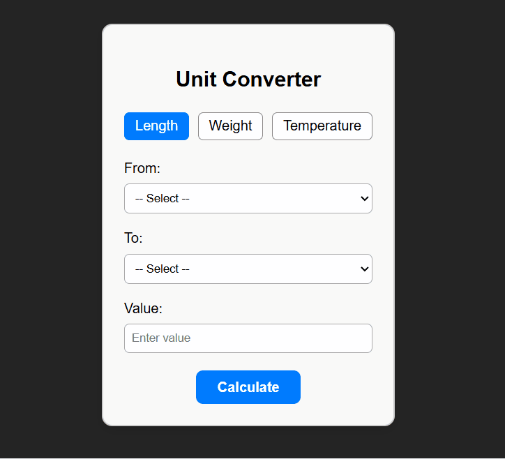

# 🧮 Unit Converter Web App

A simple web application that allows users to convert between different units of **length**, **weight**, and **temperature**. Built with **React** (frontend) and **FastAPI** (backend).

## ✨ Features

- Convert between units in three categories:
  - Length (meters, kilometers, inches, etc.)
  - Weight (grams, kilograms, pounds, etc.)
  - Temperature (Celsius, Fahrenheit, Kelvin)
- Input validation for empty fields and invalid values
- Loading indicator while conversion is in progress
- Basic error handling with user-friendly messages
- Conditional rendering based on conversion state
- RESTful backend API to perform unit conversion

---

## 🖥️ Tech Stack

### Frontend
- React (functional components with hooks)
- CSS for styling

### Backend
- FastAPI (Python)
- CORS middleware to allow frontend requests

---

## 🚀 Getting Started

### Prerequisites
- Node.js and npm
- Python 3.9 or higher
- `pip` package manager

---

### Backend Setup

1. Change to the backend directory:
   ```bash
   cd backend
   ```
2. Create and activate a virtual environment:
   ```bash
   python -m venv env
   source env/bin/activate  # On Windows use `env\Scripts\activate`
   ```
3. Install dependencies:
   ```bash
   pip install -r requirements.txt
   ```
4. Start the backend server:
   ```bash
   uvicorn main:app --reload
   ```

---

### Frontend Setup (using Vite)

1. Change to the frontend directory:
   ```bash
   cd frontend
   ```
2. Install dependencies:
   ```bash
   npm install
   ```
3. Run the Vite development server:
   ```bash
   npm run dev
   ```

## 🔄 API Overview
- **POST** `/convert`
  - **Request Body** (JSON):  
    ```json
    {
      "category": "length",
      "from_u": "meter",
      "to_u": "kilometer",
      "value": 100
    }
    ```
  - **Response** (JSON):
    ```json
    {
      "result": 0.1
    }
    ```

## 📋 Usage

- Select the category (Length, Weight, or Temperature).
- Choose the units to convert from and to.
- Enter the numeric value.
- Click **Calculate** to get the result.
- Reset the form with the **Reset** button.



---

## 📌 To Do / Improvements

- Add support for more unit categories (volume, time, etc.).
- Implement unit tests for frontend.
- Enhance UI with better styling and mobile responsiveness.
- Add loading spinner or progress indicator during conversion.

# Project From
https://roadmap.sh/projects/unit-converter
